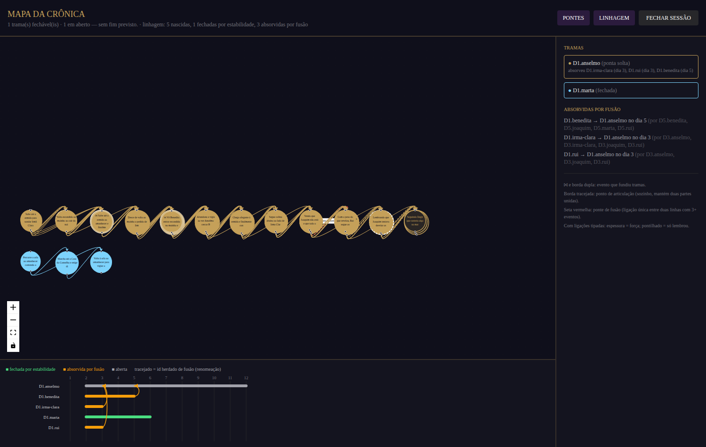

# Reanálise da validação com a emenda 1 (2026-09-25)

As 24 sessões da validação com modelos Claude (16 da Cidade Viva, 8 do controle
de três atos) reanalisadas com a métrica que separa **fusão** de **fechamento**
(`services/linhagem.ts`, emenda 1 do `pre-registro.md`), com k = 2, 3 e 5.
Gerado por:

```bash
npm run reanalisar -- --campanha <diretório com as 24 sessões>
python analise/convergencia.py <mesmo diretório>
```

Resultado com k = 3 (médias por sessão):

| | tramas nascidas | fechadas por estabilidade / nascidas | absorvidas por fusão / nascidas | convergem (emenda 1) | convergem (v0.1) |
|---|---|---|---|---|---|
| Cidade Viva (n=16) | 3,94 | 0,08 | 0,59 | 12,5% (2 de 16) | 94% |
| Três atos (n=8) | 1,00 | 0,00 | 0,00 | 0% | 88% |

Por modelo (Cidade Viva, k = 3): Sonnet 5 é o único com convergência pela
emenda (2 de 4 sessões); Haiku 4.5 e Sonnet 5 fecham ~15% das tramas por
estabilidade; Sonnet 4.6 e Opus 5 não fecham nenhuma, e 78% e 42% das tramas
nascidas deles são absorvidas por fusão.

Leitura: a definição original do pré-registro dava convergência em 15 de 16
sessões porque a curva de tramas abertas caía por fusão. Separadas as duas
causas, a maior parte das linhas de acontecimento some por fusão, não por
fechamento. Isso não refuta a hipótese (sessões de 12 dias, uma repetição por
célula), mas mostra que a medida antiga a confirmaria por um artefato.

Arquivos: `condicoes_k*.csv` (por célula), `mann_whitney_k*.csv`,
`curvas_k*_*.png` (abertas, razão de amarração, fechadas acumuladas, fundidas
acumuladas) e `reanalise.jsonl` (linhagem dia a dia de cada sessão).

## Variantes de detecção (services/grafo.ts), k = 3

`npm run reanalisar -- --campanha <dir> --variantes todas`, resultado em `variantes.csv`:

| variante | Cidade Viva: nascidas | fechadas por estab. | absorvidas por fusão | convergem (emenda 1) |
|---|---|---|---|---|
| completo (referência) | 3,94 | 0,08 | 0,59 | 12,5% |
| janela3 | 3,94 | 0,08 | 0,59 | 12,5% |
| fortes | 3,94 | 0,08 | 0,59 | 12,5% |
| sem-pontes-de-fusao | 4,25 | 0,33 | 0,49 | 6% |

- **janela3 não muda nada porque nenhuma ligação atravessa mais de 3 dias**:
  o prompt só mostra aos agentes os eventos dos últimos 3 dias (`janelaDias`),
  então a janela temporal já é imposta pela geração. O filtro só terá efeito
  com uma janela de prompt maior.
- **fortes** não muda porque estas sessões não têm ligações tipadas (a opção
  `ligacoesTipadas` foi criada depois).
- **sem-pontes-de-fusao** (56 pontes de fusão nas 24 sessões): cortar a
  ligação única que une duas linhas com 3+ eventos quadruplica a proporção de
  tramas fechadas por estabilidade (0,08 → 0,33). Parte relevante da fusão é
  feita por uma única ligação.



Mapa da Crônica da sessão do Sonnet 5 no Vale Silente (condição A): três tramas absorvidas por D1.anselmo (dias 3 e 5, com os eventos que causaram cada fusão), D1.marta fechada por estabilidade no dia 6 e D1.anselmo ainda aberta.
