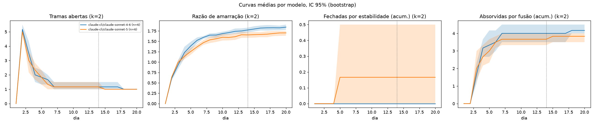
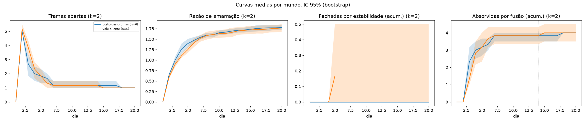
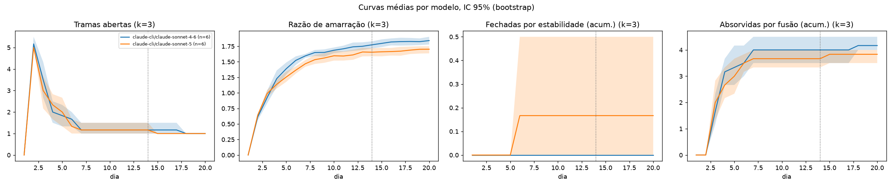
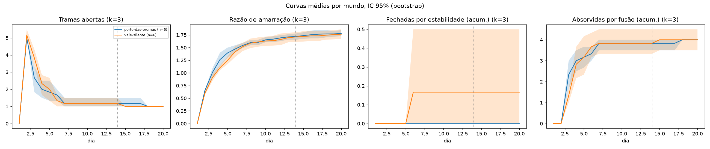
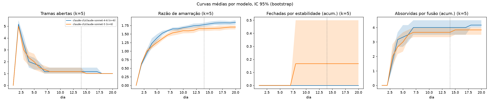
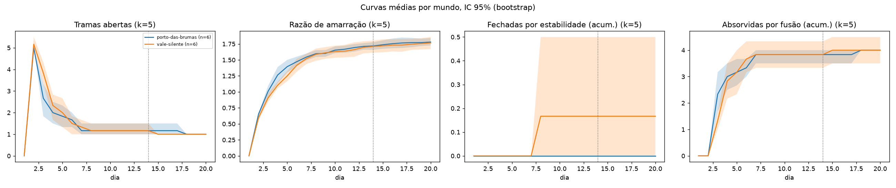

# Análise de convergência: v5-replicacao-claude

## k = 2

### Proporção de tramas fechadas por condição
| celula | modelo | estadoTramas | numAgentes | jogador | mundo | tipo | sessoes | prop_fechadas_estab_media | ic95_inf | ic95_sup | prop_fechadas_estab_mediana | prop_fundidas_media | tramas_nascidas_media | sessoes_que_convergem_emenda1 | prop_fechadas_v01_media | sessoes_que_convergem_v01 |
|---|---|---|---|---|---|---|---|---|---|---|---|---|---|---|---|---|
| porto-das-brumas_claude-cli-claude-sonnet-4-6_informa_6ag_jog-nenhum | claude-cli/claude-sonnet-4-6 | informa | 6 | nenhum | porto-das-brumas | cidade-viva | 3 | 0 | 0 | 0 | 0 | 0.8 | 5 | 0 | 0 | 0.3333 |
| porto-das-brumas_claude-cli-claude-sonnet-5_informa_6ag_jog-nenhum | claude-cli/claude-sonnet-5 | informa | 6 | nenhum | porto-das-brumas | cidade-viva | 3 | 0 | 0 | 0 | 0 | 0.8 | 5 | 0 | 0 | 0 |
| vale-silente_claude-cli-claude-sonnet-4-6_informa_6ag_jog-nenhum | claude-cli/claude-sonnet-4-6 | informa | 6 | nenhum | vale-silente | cidade-viva | 3 | 0 | 0 | 0 | 0 | 0.8111 | 5.333 | 0 | 0 | 0 |
| vale-silente_claude-cli-claude-sonnet-5_informa_6ag_jog-nenhum | claude-cli/claude-sonnet-5 | informa | 6 | nenhum | vale-silente | cidade-viva | 3 | 0.06667 | 0 | 0.2 | 0 | 0.7333 | 5 | 0 | 0.1667 | 0.3333 |

### Mann-Whitney U (bicaudal, Holm)
| dimensao | a | b | n_a | n_b | mediana_a | mediana_b | U | p | bisserial_postos | p_holm | significativo_0.05 |
|---|---|---|---|---|---|---|---|---|---|---|---|
| modelo | claude-cli/claude-sonnet-4-6 | claude-cli/claude-sonnet-5 | 6 | 6 | 0 | 0 | 15 | 0.4047 | 0.1667 | 0.8093 | False |
| mundo | porto-das-brumas | vale-silente | 6 | 6 | 0 | 0 | 15 | 0.4047 | 0.1667 | 0.8093 | False |

### Figuras
- 
- 

## k = 3

### Proporção de tramas fechadas por condição
| celula | modelo | estadoTramas | numAgentes | jogador | mundo | tipo | sessoes | prop_fechadas_estab_media | ic95_inf | ic95_sup | prop_fechadas_estab_mediana | prop_fundidas_media | tramas_nascidas_media | sessoes_que_convergem_emenda1 | prop_fechadas_v01_media | sessoes_que_convergem_v01 |
|---|---|---|---|---|---|---|---|---|---|---|---|---|---|---|---|---|
| porto-das-brumas_claude-cli-claude-sonnet-4-6_informa_6ag_jog-nenhum | claude-cli/claude-sonnet-4-6 | informa | 6 | nenhum | porto-das-brumas | cidade-viva | 3 | 0 | 0 | 0 | 0 | 0.8 | 5 | 0 | 0 | 0.3333 |
| porto-das-brumas_claude-cli-claude-sonnet-5_informa_6ag_jog-nenhum | claude-cli/claude-sonnet-5 | informa | 6 | nenhum | porto-das-brumas | cidade-viva | 3 | 0 | 0 | 0 | 0 | 0.8 | 5 | 0 | 0 | 0 |
| vale-silente_claude-cli-claude-sonnet-4-6_informa_6ag_jog-nenhum | claude-cli/claude-sonnet-4-6 | informa | 6 | nenhum | vale-silente | cidade-viva | 3 | 0 | 0 | 0 | 0 | 0.8111 | 5.333 | 0 | 0 | 0 |
| vale-silente_claude-cli-claude-sonnet-5_informa_6ag_jog-nenhum | claude-cli/claude-sonnet-5 | informa | 6 | nenhum | vale-silente | cidade-viva | 3 | 0.06667 | 0 | 0.2 | 0 | 0.7333 | 5 | 0 | 0.1667 | 0.3333 |

### Mann-Whitney U (bicaudal, Holm)
| dimensao | a | b | n_a | n_b | mediana_a | mediana_b | U | p | bisserial_postos | p_holm | significativo_0.05 |
|---|---|---|---|---|---|---|---|---|---|---|---|
| modelo | claude-cli/claude-sonnet-4-6 | claude-cli/claude-sonnet-5 | 6 | 6 | 0 | 0 | 15 | 0.4047 | 0.1667 | 0.8093 | False |
| mundo | porto-das-brumas | vale-silente | 6 | 6 | 0 | 0 | 15 | 0.4047 | 0.1667 | 0.8093 | False |

### Figuras
- 
- 

## k = 5

### Proporção de tramas fechadas por condição
| celula | modelo | estadoTramas | numAgentes | jogador | mundo | tipo | sessoes | prop_fechadas_estab_media | ic95_inf | ic95_sup | prop_fechadas_estab_mediana | prop_fundidas_media | tramas_nascidas_media | sessoes_que_convergem_emenda1 | prop_fechadas_v01_media | sessoes_que_convergem_v01 |
|---|---|---|---|---|---|---|---|---|---|---|---|---|---|---|---|---|
| porto-das-brumas_claude-cli-claude-sonnet-4-6_informa_6ag_jog-nenhum | claude-cli/claude-sonnet-4-6 | informa | 6 | nenhum | porto-das-brumas | cidade-viva | 3 | 0 | 0 | 0 | 0 | 0.8 | 5 | 0 | 0 | 0.3333 |
| porto-das-brumas_claude-cli-claude-sonnet-5_informa_6ag_jog-nenhum | claude-cli/claude-sonnet-5 | informa | 6 | nenhum | porto-das-brumas | cidade-viva | 3 | 0 | 0 | 0 | 0 | 0.8 | 5 | 0 | 0 | 0 |
| vale-silente_claude-cli-claude-sonnet-4-6_informa_6ag_jog-nenhum | claude-cli/claude-sonnet-4-6 | informa | 6 | nenhum | vale-silente | cidade-viva | 3 | 0 | 0 | 0 | 0 | 0.8111 | 5.333 | 0 | 0 | 0 |
| vale-silente_claude-cli-claude-sonnet-5_informa_6ag_jog-nenhum | claude-cli/claude-sonnet-5 | informa | 6 | nenhum | vale-silente | cidade-viva | 3 | 0.06667 | 0 | 0.2 | 0 | 0.7333 | 5 | 0 | 0.1667 | 0.3333 |

### Mann-Whitney U (bicaudal, Holm)
| dimensao | a | b | n_a | n_b | mediana_a | mediana_b | U | p | bisserial_postos | p_holm | significativo_0.05 |
|---|---|---|---|---|---|---|---|---|---|---|---|
| modelo | claude-cli/claude-sonnet-4-6 | claude-cli/claude-sonnet-5 | 6 | 6 | 0 | 0 | 15 | 0.4047 | 0.1667 | 0.8093 | False |
| mundo | porto-das-brumas | vale-silente | 6 | 6 | 0 | 0 | 15 | 0.4047 | 0.1667 | 0.8093 | False |

### Figuras
- 
- 

## Variantes de detecção (média por tipo)
| variante | k | tipo | nascidas_media | prop_fechadas_estab | prop_fundidas | convergem_emenda1 |
|---|---|---|---|---|---|---|
| completo | 2 | cidade-viva | 5.083 | 0.01667 | 0.7861 | 0 |
| completo | 3 | cidade-viva | 5.083 | 0.01667 | 0.7861 | 0 |
| completo | 5 | cidade-viva | 5.083 | 0.01667 | 0.7861 | 0 |
| comunidades | 2 | cidade-viva | 5.083 | 0.5398 | 0.5618 | 0.25 |
| comunidades | 3 | cidade-viva | 5.083 | 0.4639 | 0.5877 | 0.25 |
| comunidades | 5 | cidade-viva | 5.083 | 0.3776 | 0.6206 | 0.1667 |
| fortes | 2 | cidade-viva | 5.083 | 0.01667 | 0.7861 | 0 |
| fortes | 3 | cidade-viva | 5.083 | 0.01667 | 0.7861 | 0 |
| fortes | 5 | cidade-viva | 5.083 | 0.01667 | 0.7861 | 0 |
| fortes-janela3 | 2 | cidade-viva | 5.083 | 0.01667 | 0.7861 | 0 |
| fortes-janela3 | 3 | cidade-viva | 5.083 | 0.01667 | 0.7861 | 0 |
| fortes-janela3 | 5 | cidade-viva | 5.083 | 0.01667 | 0.7861 | 0 |
| janela3 | 2 | cidade-viva | 5.083 | 0.01667 | 0.7861 | 0 |
| janela3 | 3 | cidade-viva | 5.083 | 0.01667 | 0.7861 | 0 |
| janela3 | 5 | cidade-viva | 5.083 | 0.01667 | 0.7861 | 0 |
| reducao-transitiva | 2 | cidade-viva | 5.083 | 0.01667 | 0.7861 | 0 |
| reducao-transitiva | 3 | cidade-viva | 5.083 | 0.01667 | 0.7861 | 0 |
| reducao-transitiva | 5 | cidade-viva | 5.083 | 0.01667 | 0.7861 | 0 |
| sem-pontes-de-fusao | 2 | cidade-viva | 5.25 | 0.1837 | 0.6642 | 0.08333 |
| sem-pontes-de-fusao | 3 | cidade-viva | 5.25 | 0.1733 | 0.6642 | 0.08333 |
| sem-pontes-de-fusao | 5 | cidade-viva | 5.25 | 0.1614 | 0.6761 | 0.08333 |

## Estrutura, descartes e custo por modelo
| modelo | tipo | chamadas_com_esquema | falhas_estrutura | tentativas_medias | erros_chamada | causadoPor_refs | causadoPor_descartadas | tokens_entrada | tokens_saida | custo_usd | sessoes | taxa_falha_estrutura | taxa_descarte_causadoPor |
|---|---|---|---|---|---|---|---|---|---|---|---|---|---|
| claude-cli/claude-sonnet-4-6 | cidade-viva | 209 | 0 | 1 | 0 | 1326 | 0 | 800873 | 900799 | 18.27 | 6 | 0 | 0 |
| claude-cli/claude-sonnet-5 | cidade-viva | 212 | 0 | 1 | 0 | 1226 | 0 | 1266732 | 617794 | 10.4 | 6 | 0 | 0 |
